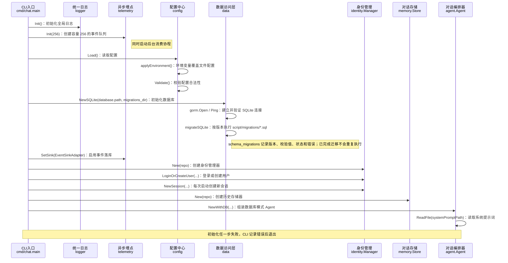
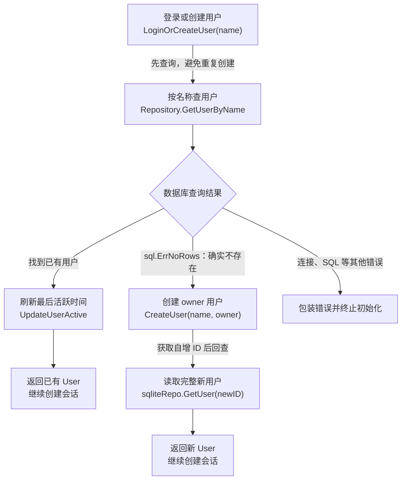
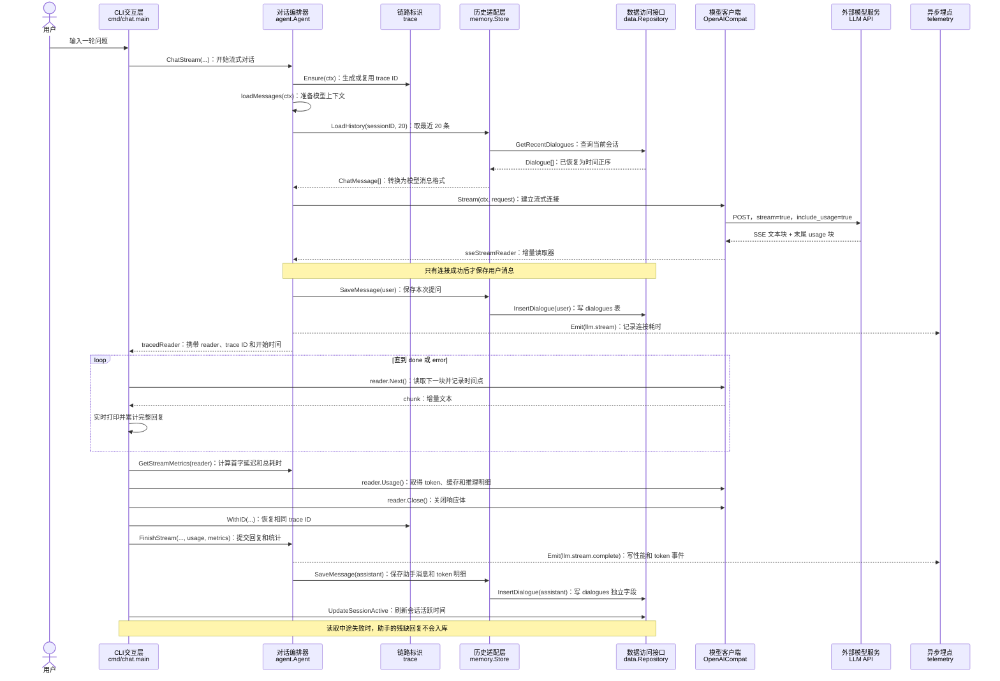
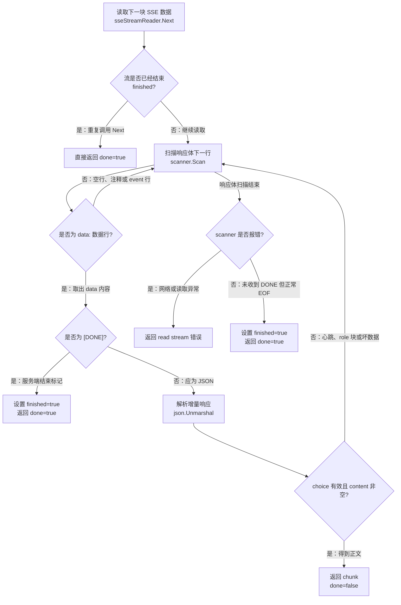
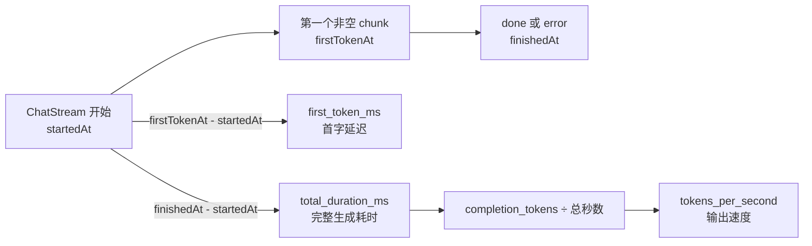
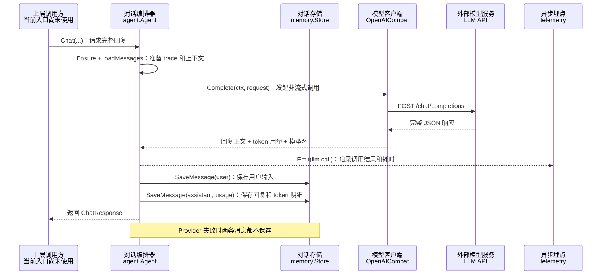
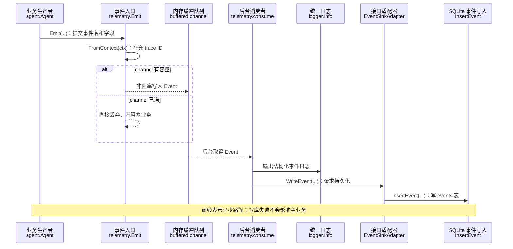
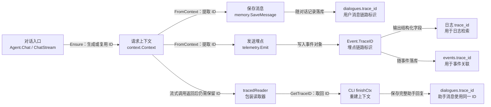

# Swallow-Go 方法调用链路文档

> 本文描述当前代码中的真实调用关系。行号会随代码演进变化，因此统一使用“文件 + 符号名”定位。

## 1. 阅读说明

调用链中的箭头表示直接调用：

```text
调用方 → 被调用方法 → 更下层方法
```

异步链路用虚线表示。外部库或网络/数据库操作保留关键节点，不展开其内部实现。

文档采用“`英文方法名（中文作用）`”的标注方式：英文名用于回到代码中搜索定位，括号内中文说明该步骤实际完成的工作。例如：

```text
Agent.ChatStream（发起流式对话）
└─ Agent.loadMessages（组装系统提示词和历史消息）
```

### 1.1 核心方法中文释义

| 方法 | 中文解释 |
| --- | --- |
| `config.Load` | 加载公共配置、本地配置和环境变量，并完成校验 |
| `data.NewSQLite` | 打开 SQLite 数据库，验证连接并自动建表 |
| `identity.LoginOrCreateUser` | 按用户名登录；用户不存在时自动创建 |
| `identity.NewSession` | 为当前用户创建一次新的会话 |
| `agent.NewWithDB` | 创建使用数据库保存历史的对话 Agent |
| `Agent.loadMessages` | 组装 system prompt 和当前会话的历史消息 |
| `Agent.ChatStream` | 发起流式 LLM 对话并返回增量读取器 |
| `Agent.FinishStream` | 流式输出结束后保存回复、token 明细和性能指标 |
| `agent.GetStreamMetrics` | 从包装读取器取得首字延迟和完整生成耗时 |
| `Agent.Chat` | 发起非流式 LLM 对话并一次返回完整回复 |
| `memory.LoadHistory` | 从数据库读取最近的对话记录并转换成 LLM 消息 |
| `memory.SaveMessage` | 将一条用户或助手消息保存到数据库 |
| `OpenAICompat.Stream` | 请求 OpenAI 兼容接口并建立 SSE 流式连接 |
| `OpenAICompat.Complete` | 请求 OpenAI 兼容接口并解析完整 JSON 回复 |
| `StreamReader.Next` | 读取下一段流式文本；同时判断是否结束或出错 |
| `trace.Ensure` | 从上下文获取 trace ID；没有时自动生成 |
| `telemetry.Emit` | 非阻塞发送一条埋点事件 |
| `telemetry.consume` | 后台消费埋点，写日志并保存到数据库 |
| `Manager.TouchSession` | 更新当前会话最后活跃时间 |

## 2. 入口总览

| 入口 | 顶层函数 | 核心链路 |
| --- | --- | --- |
| CLI 对话 | `cmd/chat.main` | 配置 → SQLite → 身份/会话 → Agent → LLM SSE → 对话落库 |
| HTTP 服务 | `cmd/server.main` | 日志/埋点 → 配置 → SQLite → Hertz → `/ping` |

## 3. CLI 启动链路



方法展开：

```text
cmd/chat.main
├─ flag.String / flag.Parse（读取 -user 命令行参数）
├─ logger.Init（初始化全局日志）
│  └─ zap.NewDevelopment（创建开发模式 zap logger）
├─ telemetry.Init（初始化埋点队列）
│  └─ go telemetry.consume（启动后台埋点消费协程）
├─ config.Load（加载并校验配置）
│  ├─ toml.DecodeFile(config.toml 或 SWALLOW_CONFIG)（读取主配置）
│  ├─ toml.DecodeFile(config.local.toml，可选)（叠加本地配置）
│  ├─ config.applyEnvironment（用环境变量覆盖配置）
│  └─ Config.Validate（校验端口、URL、模型和数据库路径）
├─ data.NewSQLite（通过 GORM 初始化 SQLite）
│  ├─ os.MkdirAll（创建数据库目录）
│  ├─ gorm.Open(sqlite.Open(...))（创建 GORM 数据库实例）
│  ├─ db.DB().Ping（验证底层连接池可访问）
│  └─ migrateSQLite（校验迁移文件并按版本执行）
│     ├─ loadMigrations（解析文件名、排序并计算 SHA-256）
│     └─ applyMigration（事务执行 SQL，同时写入完成状态）
├─ telemetry.SetSink（让埋点可以写入数据库）
├─ identity.New（创建身份管理器）
├─ Manager.LoginOrCreateUser（登录或创建用户）
├─ Manager.NewSession（创建本次 CLI 会话）
├─ llm.NewOpenAICompat（创建 LLM 客户端）
├─ memory.New（创建对话历史存储器）
└─ agent.NewWithDB（创建数据库持久化 Agent）
   └─ os.ReadFile(prompts/system.md)（读取系统提示词）
```

## 4. 用户登录或创建链路



SQLite 实现的直接调用关系：

```text
Manager.LoginOrCreateUser
├─ Repository.GetUserByName（按用户名查询用户）
│  └─ sqliteRepo.GetUserByName（执行 GORM 查询）
│     └─ db.WithContext(...).Where(...).First(...)（读取 ORM 模型并转为 User）
├─ [已存在] Repository.UpdateUserActive（刷新用户活跃时间）
│  └─ sqliteRepo.UpdateUserActive
│     └─ db.Model(...).Where(...).Update(...)（通过 GORM 更新字段）
└─ [不存在] Repository.CreateUser（创建 owner 用户）
   └─ sqliteRepo.CreateUser
      ├─ db.WithContext(...).Create(&model)（通过 GORM 插入用户）
      └─ userFromORM（映射为业务 User，ID 和时间已自动回填）
```

`fmt.Errorf(... %w ...)` 保留了底层 `sql.ErrNoRows`，因此上层 `errors.Is(err, sql.ErrNoRows)` 可以识别“用户不存在”。

## 5. 新建会话链路

```text
cmd/chat.main
└─ Manager.NewSession(ctx, userID)（创建新会话）
   ├─ uuid.NewString（生成唯一 session ID）
   └─ Repository.CreateSession（写入会话记录）
      └─ sqliteRepo.CreateSession
         ├─ db.WithContext(...).Create(&model)（通过 GORM 插入会话）
         └─ sessionFromORM（映射为业务 Session）
```

每次 CLI 启动均走此链路，因此始终创建新 session。

## 6. 流式对话主链路

这是当前 CLI 实际使用的核心链路。



### 6.1 Agent 组装请求

```text
Agent.ChatStream
├─ trace.Ensure（取得或生成本轮 trace ID）
│  ├─ trace.FromContext（尝试从 context 读取）
│  └─ [无 ID] trace.New → uuid.NewString → trace.WithID（生成并写回 context）
├─ Agent.loadMessages（组装 LLM 上下文）
│  └─ memory.Store.LoadHistory（加载最近历史）
│     └─ Repository.GetRecentDialogues（查询当前 session 对话）
│        └─ sqliteRepo.GetRecentDialogues
│           ├─ Where + Order(timestamp, id) + Limit + Find（稳定取最近 20 条）
│           ├─ dialogueFromORM（转换为业务 Dialogue）
│           └─ 写入结果切片时反转为时间正序（保证 LLM 按时间阅读）
├─ append 当前 user ChatMessage（把本次提问追加到上下文）
├─ Provider.Stream（连接 LLM 流式接口）
├─ memory.Store.SaveMessage(user)（连接成功后保存用户消息）
│  └─ Repository.InsertDialogue（写入 dialogues 表）
└─ telemetry.Emit(llm.stream)（记录连接结果和耗时）
```

发送给 LLM 的消息顺序是：

```text
[system prompt] + [当前 session 最近 20 条历史消息] + [本次用户消息]
```

### 6.2 Provider 建立 SSE 连接

```text
OpenAICompat.Stream
├─ req.Stream = true（声明需要流式响应）
├─ req.StreamOptions.IncludeUsage = true（请求末尾返回 token 用量）
├─ json.Marshal(req)（把请求对象编码成 JSON）
├─ http.NewRequestWithContext（创建可超时、可取消的 POST 请求）
├─ Header.Set(Content-Type, application/json)（声明请求格式）
├─ Header.Set(Authorization, Bearer <apiKey>)（设置鉴权信息）
├─ Header.Set(Accept, text/event-stream)（声明接收 SSE）
├─ http.Client.Do（向 LLM 服务发送请求）
├─ [非 200] io.ReadAll + response body Close + 返回错误（读取上游错误）
└─ [200] newSSEScanner(response body)（创建逐行扫描器）
   └─ 返回 sseStreamReader（交给调用方逐块读取）
```

### 6.3 读取一个 SSE 块



### 6.4 流式结果持久化

```text
cmd/chat.main
├─ agent.GetTraceID(tracedReader)（取回本轮 trace ID）
├─ 循环 reader.Next（读取并打印增量文本，同时拼接完整回复）
│  └─ tracedReader.Next（记录首个非空 chunk 和结束时间）
├─ reader.Usage（取得输入、输出、缓存、推理和总 token）
├─ agent.GetStreamMetrics（计算 first_token_ms 和 total_duration_ms）
├─ reader.Close（关闭 LLM HTTP 响应体）
├─ trace.WithID(context.Background, traceID)（重建携带同一 trace ID 的 context）
├─ [读取成功] Agent.FinishStream（接收完整回复、usage 和 metrics）
│  ├─ 计算 tokens_per_second（输出 token ÷ 总秒数）
│  ├─ telemetry.Emit(llm.stream.complete)（保存性能与 token 明细）
│  └─ memory.Store.SaveMessage(assistant)（转换并保存 assistant 消息）
│     └─ Repository.InsertDialogue（调用统一数据接口）
│        └─ sqliteRepo.InsertDialogue（执行 GORM + SQLite 实现）
│           └─ db.Create（写入回复和各 token 独立字段）
└─ Manager.TouchSession（刷新会话活跃时间）
   └─ Repository.UpdateSessionActive
      └─ sqliteRepo.UpdateSessionActive
         └─ db.Model(...).Where(...).Update(...)（更新活跃时间）
```

如果 SSE 读取中途失败，用户消息已经入库，助手的部分回复不会入库。

### 6.5 流式性能指标计算



`tracedReader.Next` 负责记录三个时间点，`agent.GetStreamMetrics` 只负责做时间差计算。指标最终写入 `llm.stream.complete` 事件；token 明细同时写入助手对应的 `dialogues` 记录。

消息保存成功后还会产生精简的 `dialogue` 事件，只包含 `session_id`、`user_id`、`role`、`content_chars`、`content_bytes` 和 `status`。该事件不重复保存 token 明细。

## 7. 非流式对话链路

当前入口没有调用 `Agent.Chat`，但该方法已经实现，可供未来 HTTP handler 或测试使用。



详细方法链：

```text
Agent.Chat
├─ trace.Ensure（取得或生成 trace ID）
├─ Agent.loadMessages（组装系统提示词和历史消息）
├─ Provider.Complete（调用非流式 Provider）
│  └─ OpenAICompat.Complete（执行 OpenAI 兼容请求）
│     ├─ json.Marshal（编码请求 JSON）
│     ├─ http.NewRequestWithContext（创建 POST 请求）
│     ├─ http.Client.Do（发送 HTTP 请求）
│     ├─ json.Decoder.Decode(APIResponse)（解析完整 JSON 响应）
│     └─ 返回 choices[0].message + usage + model（提取回复、用量和模型）
├─ telemetry.Emit(llm.call)（记录成功或失败埋点）
└─ Agent.saveMessages（保存本轮两条消息）
   ├─ memory.Store.SaveMessage(user, usage零值)（保存用户输入）
   │  └─ Repository.InsertDialogue
   └─ memory.Store.SaveMessage(assistant, usage)（保存助手回复和 token 明细）
      └─ Repository.InsertDialogue
```

Provider 调用失败时会发出 `status=error` 埋点，不保存本轮任一消息。Provider 成功但消息持久化失败时，调用方收到错误，即使 LLM 已经成功生成了回复。

## 8. 异步埋点链路



调用链：

```text
Agent.Chat / Agent.ChatStream
└─ telemetry.Emit（发送埋点）
   ├─ trace.FromContext（读取本轮 trace ID）
   └─ non-blocking send(global channel)（非阻塞写入缓冲队列，满时丢弃）

telemetry.consume [后台 goroutine]（持续消费埋点事件）
├─ logger.Info（输出结构化日志）
│  └─ logger.L().Info（调用全局 zap logger）
└─ EventSinkAdapter.WriteEvent（把 telemetry 接口适配为 Repository）
   └─ Repository.InsertEvent(context.Background)（保存事件）
      └─ sqliteRepo.InsertEvent（执行 GORM + SQLite 实现）
         └─ db.WithContext(...).Create(&model)（插入 events 表）
```

注意：`EventSinkAdapter.WriteEvent` 使用新的 `context.Background()`，依靠显式传入的 `traceID` 保持关联，不继承原请求的取消和超时。

## 9. HTTP 服务启动与请求链路

### 9.1 启动链路

```text
cmd/server.main
├─ logger.Init（初始化业务日志）
├─ telemetry.Init(256)（初始化埋点队列）
├─ config.Load（加载并校验配置）
├─ data.NewSQLite（初始化数据库并建表）
├─ telemetry.SetSink(data.EventSinkAdapter)（配置事件落库）
├─ hlog.SetLogger(zaplog.NewLogger())（配置 Hertz 框架日志）
├─ server.Default(WithHostPorts(:port))（创建并设置监听端口）
├─ handler.NewDeps(cfg, repo)（组装共享 Provider、Memory 和 Identity）
├─ router.Register(h, deps)（注册全部 HTTP 路由）
│  ├─ GET /ping
│  ├─ POST /api/session
│  ├─ GET /api/history
│  └─ POST /api/chat
└─ h.Spin（启动并阻塞运行 HTTP 服务）
```

### 9.2 `/ping` 请求链路

```text
HTTP GET /ping
└─ Hertz router（根据路径匹配处理器）
   └─ handler.Ping(ctx, requestContext)（执行健康检查处理器）
      └─ requestContext.JSON(200, {"message": "pong"})（返回 JSON 响应）
```

该请求不访问 Agent、LLM、SQLite 或 telemetry。

### 9.3 HTTP SSE 对话链路

```text
POST /api/chat
└─ Deps.Chat
   ├─ BindAndValidate（解析 session_id 和 message）
   ├─ Repository.GetSession（验证会话并取得 user_id）
   ├─ agent.NewWithDB（按当前 session 创建轻量 Agent）
   ├─ Agent.ChatStream（连接 LLM）
   ├─ 循环 StreamReader.Next（向客户端刷新 SSE chunk）
   ├─ StreamReader.Usage（取得 token 明细）
   ├─ agent.GetStreamMetrics（取得首字延迟和总耗时）
   ├─ Agent.FinishStream（保存回复、用量和性能事件）
   └─ Manager.TouchSession（刷新会话活跃时间）
```

## 10. 数据访问方法映射

| 业务方法 | Repository 方法 | GORM 操作 |
| --- | --- | --- |
| `LoginOrCreateUser` 查询用户 | `GetUserByName` | `Where(name).First` |
| `LoginOrCreateUser` 创建用户 | `CreateUser` | `Create(&ormUser)`，自动回填 ID 和时间 |
| `LoginOrCreateUser` 更新活跃 | `UpdateUserActive` | `Model.Where.Update(last_active_at)` |
| `NewSession` | `CreateSession` | `Create(&ormSession)` |
| `GetSession` | `GetSession` | `First(id = sessionID)` |
| `TouchSession` | `UpdateSessionActive` | `Model.Where.Update(last_active_at)` |
| `Store.SaveMessage` | `InsertDialogue` | `Create(&ormDialogue)`，写入回复及六类 token 字段 |
| `Store.LoadHistory` | `GetRecentDialogues` | 按 `timestamp DESC, id DESC` 查询，再反转为稳定时间正序 |
| telemetry sink | `InsertEvent` | `Create(&ormEvent)` |

## 11. Trace ID 传播路径



流式读取发生在 `ChatStream` 返回之后，因此 Agent 用 `tracedReader` 将 trace ID 带回 CLI。CLI 再创建带相同 ID 的 `finishCtx`，用于保存助手消息。

## 12. 错误与中断分支

| 位置 | 行为 | 数据影响 |
| --- | --- | --- |
| 配置加载失败 | CLI/Server 停止 | 无 |
| SQLite 初始化失败 | CLI/Server 停止 | 无新业务数据 |
| 用户/会话初始化失败 | CLI 停止 | 可能已创建前序数据 |
| `ChatStream` 建连失败 | 返回错误并发失败埋点 | 本轮消息不保存 |
| 流连接成功、保存 user 失败 | 主动关闭 reader并返回错误 | LLM 连接已建立，user 未可靠保存 |
| `Next` 中途失败 | CLI 停止本轮读取 | user 已保存，assistant 不保存 |
| `FinishStream` 失败 | 记录错误后继续 | assistant 可能缺失 |
| telemetry channel 满 | 静默丢事件 | 不影响主业务 |
| telemetry 写库失败 | 被适配器忽略 | 事件缺失，不影响主业务 |

## 13. 当前 HTTP 路由职责

| 路由 | Handler | 调用链 |
| --- | --- | --- |
| `GET /ping` | `handler.Ping` | 直接返回健康状态 |
| `POST /api/session` | `Deps.CreateSession` | 登录/创建用户 → 创建 session |
| `GET /api/history` | `Deps.GetHistory` | 按 session 查询最近 50 条对话 |
| `POST /api/chat` | `Deps.Chat` | 校验 session → 创建 Agent → LLM SSE → 保存回复和统计 |

共享的 `Provider`、`Memory`、`Identity` 在服务启动时只创建一次；带固定 `sessionID/userID` 的 Agent 按请求创建，避免不同用户共享会话状态。
