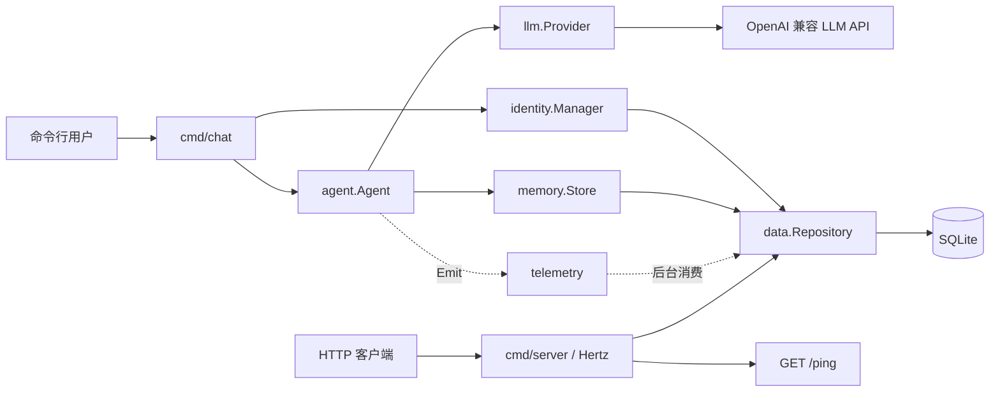

# Swallow-Go 项目文档

> 文档基于当前仓库代码整理，描述的是已经实现的能力，不等同于根目录 `swallow-项目方案.md` 中的远期规划。

## 1. 项目概述

Swallow-Go 是 Swallow AI 助手的 Go 端工程。目前实现了两个独立运行入口：

- `cmd/server`：基于 Hertz 的 HTTP 服务，目前只提供健康检查接口 `GET /ping`。
- `cmd/chat`：命令行对话程序，支持 OpenAI Chat Completions 兼容接口、SSE 流式输出、用户与会话管理、SQLite 对话持久化、trace ID 和异步埋点。

当前代码处于 Phase 2 形态。LLM 对话尚未接入 HTTP 路由，管理后台、工具调用、长期记忆、自成长和多模态能力仍属于规划内容。

## 2. 技术栈

| 类别 | 技术 | 用途 |
| --- | --- | --- |
| 语言 | Go 1.25.12（`go.mod` 声明） | 服务端与 CLI |
| Web 框架 | CloudWeGo Hertz | HTTP 服务与路由 |
| 配置 | BurntSushi/toml | TOML 配置加载 |
| 数据库 | GORM + SQLite | ORM 数据访问、用户、会话、对话和事件存储 |
| 日志 | zap | 业务日志与 Hertz 日志 |
| LLM 协议 | OpenAI Chat Completions 兼容协议 | 非流式和 SSE 流式对话 |
| 标识 | google/uuid | 会话 ID 与 trace ID |

GORM 的 SQLite 驱动底层使用 `go-sqlite3`，因此本地构建仍需要可用的 C 编译器。

## 3. 目录结构

```text
swallow-go/
├── biz/
│   ├── handler/ping.go             # /ping 处理器
│   └── router/register.go          # Hertz 生成路由的预留注册点
├── cmd/
│   ├── chat/main.go                # CLI 流式对话入口
│   └── server/main.go              # HTTP 服务入口
├── docs/                           # 项目文档
├── internal/
│   ├── agent/agent.go              # 对话编排、历史组装、持久化协调
│   ├── config/config.go            # 配置加载、环境变量覆盖、校验
│   ├── data/                       # Repository、GORM 模型与 SQLite 实现
│   ├── identity/manager.go         # 用户登录/创建与会话管理
│   ├── memory/store.go             # 对话历史读写适配
│   ├── provider/llm/               # LLM 接口、数据结构、OpenAI 兼容实现
│   ├── telemetry/telemetry.go      # 非阻塞异步事件采集
│   └── trace/trace.go              # context 中的 trace ID
├── pkg/logger/logger.go            # 全局 zap logger
├── prompts/system.md               # Agent 系统提示词
├── script/schema.sql               # SQLite 完整结构快照（仅供审查和排障）
├── script/migrations/              # 应用启动时执行的版本化 SQL
├── config.toml                     # 公共默认配置
├── config.local.toml               # 本地覆盖配置（可能包含密钥）
├── go.mod / go.sum                 # Go 模块与依赖
└── Makefile                        # 常用运行、构建命令
```

## 4. 总体架构



### 分层职责

- 入口层：解析参数、组装依赖、管理生命周期。
- Agent 层：对话用例编排，不关心具体 HTTP 或 SQL 实现。
- Provider 层：屏蔽不同 OpenAI 兼容模型服务的差异。
- Memory/Identity 层：分别封装对话历史和身份会话业务。
- Data 层：通过 `Repository` 隔离业务与 GORM/SQLite，业务模块不直接操作 ORM。
- Trace/Telemetry 层：提供轻量链路标识、日志和事件落库。

## 5. 运行方式

### 5.1 环境准备

1. 安装与 `go.mod` 兼容的 Go 工具链。
2. 安装可供 CGO 使用的 C 编译器。
3. 在项目根目录执行命令；配置文件和系统提示词使用相对路径读取。

### 5.2 配置 LLM

公共配置位于 `config.toml`。建议将个人配置写入 `config.local.toml`：

```toml
[llm]
base_url = "https://api.deepseek.com/v1"
api_key = "your-api-key"
model = "deepseek-chat"
```

不要将真实 API Key 提交到版本库。

### 5.3 启动 CLI 对话

```bash
go run ./cmd/chat -user owner
```

也可执行：

```bash
make chat
```

输入 `quit` 退出。CLI 会为指定用户名查找或创建用户，并在每次启动时创建一个全新的 session。

### 5.4 启动 HTTP 服务

```bash
go run ./cmd/server
```

或：

```bash
make run
```

默认监听 `8888` 端口：

```bash
curl http://localhost:8888/ping
```

预期响应：

```json
{"message":"pong"}
```

### 5.5 构建和测试

```bash
go build ./...
go test ./...
```

Makefile 还提供 `make build`、`make tidy` 和 `make clean`。其中 `make build` 当前生成 Windows 文件名 `bin/swallow-go.exe`。

## 6. 配置系统

配置加载顺序如下，后加载值覆盖先加载值：

1. 设置 `SWALLOW_CONFIG` 时，只读取该文件。
2. 未设置时，先读取必需的 `config.toml`。
3. 若存在，再叠加 `config.local.toml`。
4. 最后使用环境变量覆盖。

支持的环境变量：

| 环境变量 | 对应配置 |
| --- | --- |
| `SWALLOW_CONFIG` | 显式指定配置文件 |
| `SWALLOW_SERVER_PORT` | `server.port` |
| `SWALLOW_LLM_BASE_URL` | `llm.base_url` |
| `SWALLOW_LLM_API_KEY` | `llm.api_key` |
| `SWALLOW_LLM_MODEL` | `llm.model` |
| `SWALLOW_DATABASE_PATH` | `database.path` |

启动时会校验端口范围、LLM URL、模型名称和数据库路径。API Key 不在通用配置校验中强制要求，但 CLI 会单独拒绝空 Key；HTTP 服务即使 Key 为空也可启动，因为当前不调用 LLM。

## 7. 核心模块

### 7.1 Agent

`agent.Agent` 是对话编排核心：

- 从 `prompts/system.md` 加载 system prompt。
- 从数据库加载当前 session 最近 20 条消息，并恢复为时间正序。
- 在调用前追加当前用户消息。
- 选择 `Complete` 或 `Stream` 调用 Provider。
- 通过 Memory 保存用户和助手消息。
- 发送 `llm.call` 或 `llm.stream` 埋点。

`New` 创建纯内存 Agent，适合测试；`NewWithDB` 创建 SQLite 持久化 Agent，是 CLI 当前采用的模式。

### 7.2 LLM Provider

`llm.Provider` 定义两个能力：

- `Complete`：非流式返回完整文本和 token usage。
- `Stream`：返回 `StreamReader`，调用者循环执行 `Next()` 获取增量文本。

`OpenAICompat` 请求 `{base_url}/chat/completions`，使用 Bearer Token 鉴权。流式请求会发送 `stream_options.include_usage=true`，逐行解析 `data: ...`，在 `[DONE]` 时结束，并从结束前的 usage 数据块读取 prompt、completion 和 total token；单行 JSON 解析失败时会跳过该数据块。

### 7.3 Memory 与 Identity

`memory.Store` 将 `llm.ChatMessage` 与 `data.Dialogue` 相互适配。查询历史时跳过 system 消息，因为 system prompt 由 Agent 单独注入。

`identity.Manager` 负责：

- 按名称查找用户；不存在时以 `owner` 角色创建。
- 已存在用户登录时更新活跃时间。
- 生成 UUID session 并写入数据库。
- 对话结束后更新 session 活跃时间。

### 7.4 Trace 与 Telemetry

`trace.Ensure` 为一次对话生成 trace ID，并通过 `context.Context` 向下传递。该 ID会写入对话记录、事件和日志，以便关联同一次请求。

`telemetry.Emit` 将事件非阻塞写入缓冲 channel；channel 满时直接丢弃，避免阻塞对话。后台 goroutine 负责记录日志，并通过适配器写入 `events` 表。事件写库错误当前被忽略。

事件数据按职责拆分，避免重复：`dialogue` 只记录会话、用户、角色和内容长度；token 明细保存在 `dialogues` 表；调用性能与 token 汇总保存在 `llm.stream.complete` 事件。

业务日志统一通过 `pkg/logger` 输出。CLI 中的 `fmt.Print` 仅承担用户提示符和流式回答展示，不作为日志使用；Hertz 框架自身的日志通过 zap 适配器输出。

## 8. 数据库设计

数据库打开后由版本化迁移器按顺序执行 `script/migrations/*.sql`，并启用 WAL 和 5 秒 busy timeout。每份迁移的版本、名称、SHA-256、执行状态和错误会记录到 `schema_migrations`。SQL 与完成状态在同一事务内提交，失败时回滚本次结构变化并留下失败记录。

完整 SQLite DDL 同步保存在 `script/schema.sql`，用于人工审查和排障；应用运行时以 `script/migrations` 为唯一迁移来源。项目只使用 `user_id`、`session_id` 等关联字段，不建立数据库外键约束。修改表结构时必须新增下一个版本的迁移文件，并同步更新结构快照；已经执行过的迁移禁止修改，否则校验值检查会拒绝启动。

| 表 | 用途 | 关键字段 |
| --- | --- | --- |
| `users` | 用户身份 | `id`, `name`, `role`, `last_active_at` |
| `sessions` | 一次会话 | `id`, `user_id`, `status`, `last_active_at` |
| `dialogues` | 对话消息与用量 | `session_id`, `role`, `content`, `prompt_tokens`, `completion_tokens`, `cache_hit_tokens`, `cache_miss_tokens`, `reasoning_tokens`, `total_tokens`, `trace_id` |
| `events` | 埋点事件 | `event_type`, `event_data`, `trace_id`, `duration_ms`, `success` |

主要索引覆盖 session 对话时间、事件类型时间，以及 dialogues/events 的 trace ID。

## 9. HTTP API

### `GET /ping`

服务健康检查。

- 请求参数：无
- 成功状态：`200 OK`
- 响应：`{"message":"pong"}`

当前没有 HTTP 对话 API；对话能力只能从 `cmd/chat` 使用。

## 10. 错误处理与资源生命周期

- 配置、数据库和 Agent 初始化失败时，入口停止运行。
- CLI 单轮 LLM 调用使用 60 秒 context 超时。
- SSE reader 由 CLI 在读取结束后显式关闭。
- SQLite repository 在入口退出时通过 `defer Close()` 关闭。
- LLM 非 200 响应会携带状态码和响应体返回错误；注意响应体可能包含上游服务的详细信息。
- 流式连接成功后才保存用户消息；读取中途失败时不保存助手的残缺内容，但已保存的用户消息会保留。

## 11. 当前边界与已知注意点

- HTTP 服务尚未组装 Agent，因此 `/ping` 以外没有业务 API。
- CLI 每次启动创建新 session，当前没有恢复旧 session 的命令行参数，所以“重启不丢数据”表示记录仍在数据库，并不表示新进程自动续接旧上下文。
- Agent 只加载当前 session 的最近 20 条消息，不跨 session 形成长期记忆。
- `llm.stream` 事件记录建立流连接的状态和耗时；`llm.stream.complete` 事件记录流读取完成后的输入、输出、缓存命中、缓存未命中、推理和总 token。助手消息使用独立字段保存 token 明细，并统一以 `total_tokens` 表示本轮总量。
- telemetry 是进程内全局对象，没有显式 shutdown/flush；进程快速退出时，队列尾部事件可能尚未落库。
- 数据库时间字段解析错误被忽略；事件落库错误也被适配器忽略。
- `users.name` 没有唯一约束，并发首次登录同名用户时可能产生重复记录。
- 当前自动化测试只覆盖配置校验和环境变量覆盖，Agent、Provider、Repository 与 HTTP handler 尚缺测试。

## 12. 扩展指引

### 新增 LLM 实现

实现 `llm.Provider` 的 `Complete` 和 `Stream`，然后在入口组装时替换 `NewOpenAICompat`。Agent 无需修改。

### 新增数据库实现

实现 `data.Repository`，再将入口中的 `data.NewSQLite` 替换为新的构造函数。Identity 和 Memory 不需要感知具体数据库或 GORM。

### 新增 HTTP 对话接口

建议在服务启动阶段统一组装 Repository、Provider、Memory、Identity 和 Agent/Agent 工厂，再由 handler 调用 Agent。不要在每个请求中重复初始化数据库或 HTTP client；同时需要定义 session 传递、流式 SSE 响应、超时和断连取消策略。

更细的方法级调用关系见 [Swallow-Go方法调用链路文档.md](./Swallow-Go方法调用链路文档.md)。
